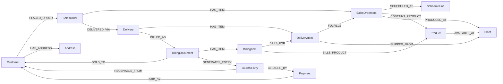
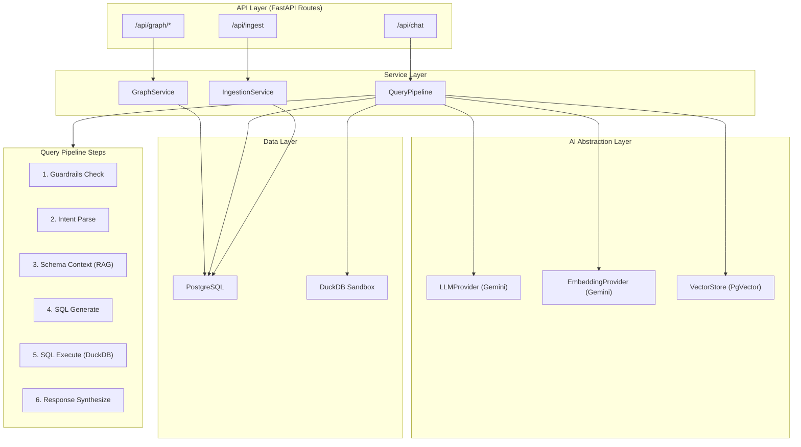
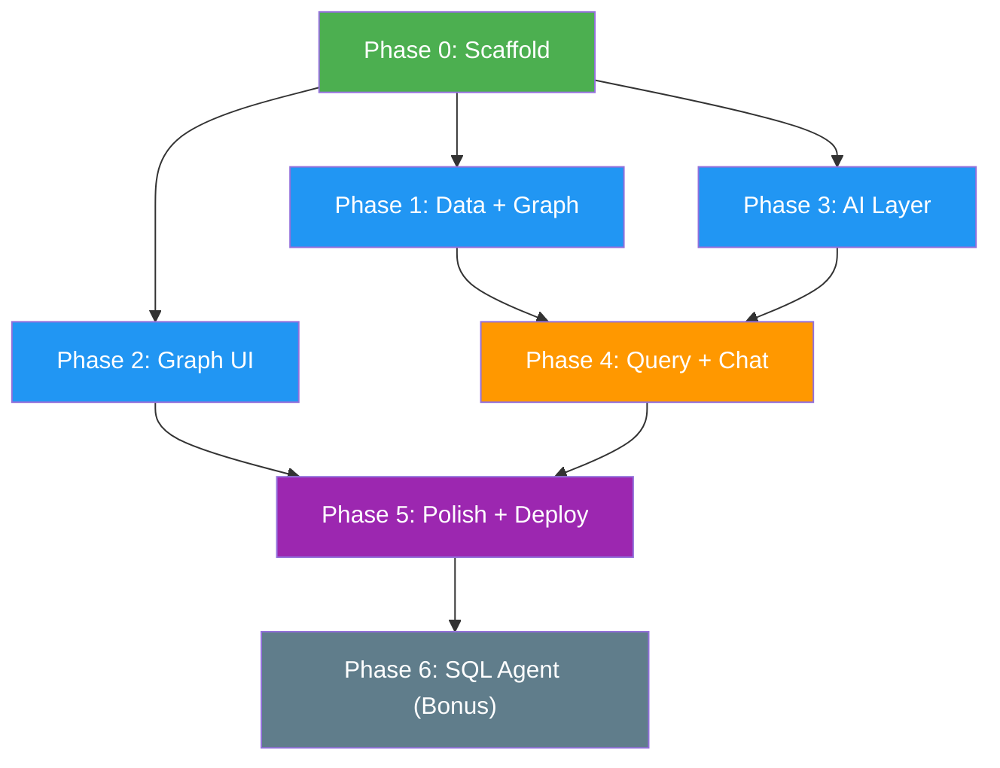

# DodgeAI — Architecture Solution Document

> **Graph-Based Data Modeling and Query System for SAP Order-to-Cash**

---

## Table of Contents

1. [Problem Statement](#1-problem-statement)
2. [High-Level Architecture](#2-high-level-architecture)
3. [Data Model & Graph Schema](#3-data-model--graph-schema)
4. [Technology Decisions](#4-technology-decisions)
5. [Component Architecture](#5-component-architecture)
6. [Phase Plan (Parallel Worktrees)](#6-phase-plan-parallel-worktrees)
7. [Out of Scope](#7-out-of-scope)
8. [Guardrails & Domain Restriction](#8-guardrails--domain-restriction)
9. [Artifacts Per Task](#9-artifacts-per-task)
10. [Acceptance Criteria](#10-acceptance-criteria)

---

## 1. Problem Statement

Business data in SAP Order-to-Cash (O2C) systems is fragmented across 19+ tables — sales orders, deliveries, invoices, journal entries, payments — with no unified way to trace relationships.

**Goal:** Build a context-graph system that:
- Ingests SAP O2C JSONL dataset into PostgreSQL
- Constructs a relationship graph from the relational data
- Visualizes the graph in a React UI (expand nodes, inspect metadata, trace flows)
- Provides a chat interface that translates natural language → SQL → data-backed answers
- Enforces strict guardrails: responses grounded in dataset only

---

## 2. High-Level Architecture

```
┌─────────────────────────────────────────────────────────────────────┐
│                        FRONTEND (React + TS)                        │
│  ┌──────────────────┐  ┌──────────────────┐  ┌──────────────────┐  │
│  │  Graph Explorer   │  │  Chat Interface  │  │  Query Results   │  │
│  │  (react-force-    │  │  (streaming NL   │  │  (tables, cards, │  │
│  │   graph / cyto)   │  │   responses)     │  │   highlights)    │  │
│  └──────┬───────────┘  └──────┬───────────┘  └──────┬───────────┘  │
│         │                      │                      │              │
│         └──────────────────────┼──────────────────────┘              │
│                                │ REST / WebSocket                    │
└────────────────────────────────┼────────────────────────────────────┘
                                 │
┌────────────────────────────────┼────────────────────────────────────┐
│                     BACKEND (FastAPI)                                │
│  ┌──────────────┐  ┌──────────┴──────────┐  ┌──────────────────┐   │
│  │ Graph API     │  │  Chat / Query API   │  │  Data Ingestion  │   │
│  │ /api/graph/*  │  │  /api/chat          │  │  /api/ingest     │   │
│  └──────┬───────┘  └──────────┬──────────┘  └──────┬───────────┘   │
│         │                      │                     │               │
│  ┌──────┴───────┐  ┌──────────┴──────────┐  ┌──────┴───────────┐   │
│  │ Graph        │  │  NL Query Pipeline   │  │  JSONL Loader    │   │
│  │ Service      │  │  ┌────────────────┐  │  │  + Schema        │   │
│  │ (build/query │  │  │ Guardrails     │  │  │    Discovery     │   │
│  │  graph from  │  │  │ (domain check) │  │  └──────────────────┘   │
│  │  PG tables)  │  │  ├────────────────┤  │                         │
│  └──────────────┘  │  │ Intent Parser  │  │                         │
│                     │  │ (Gemini LLM)   │  │                         │
│                     │  ├────────────────┤  │                         │
│                     │  │ SQL Generator  │  │                         │
│                     │  │ (Text-to-SQL)  │  │                         │
│                     │  ├────────────────┤  │                         │
│                     │  │ SQL Executor   │  │                         │
│                     │  │ (PG / DuckDB)  │  │                         │
│                     │  ├────────────────┤  │                         │
│                     │  │ Response       │  │                         │
│                     │  │ Synthesizer    │  │                         │
│                     │  └────────────────┘  │                         │
│                     └─────────────────────┘                         │
│                                                                      │
│  ┌──────────────────────────────────────────────────────────────┐    │
│  │         Abstraction Layers                                    │    │
│  │  ┌─────────────┐  ┌──────────────┐  ┌─────────────────┐     │    │
│  │  │ LLM Provider │  │ Embedding    │  │ Vector Store    │     │    │
│  │  │ (Protocol)   │  │ Provider     │  │ (Protocol)      │     │    │
│  │  │ └─ Gemini    │  │ (Protocol)   │  │ └─ PgVector     │     │    │
│  │  │   Impl       │  │ └─ Gemini    │  │   Impl          │     │    │
│  │  └─────────────┘  │   Impl       │  └─────────────────┘     │    │
│  │                     └──────────────┘                          │    │
│  └──────────────────────────────────────────────────────────────┘    │
└──────────────────────────────────────────────────────────────────────┘
                                 │
┌────────────────────────────────┼────────────────────────────────────┐
│                      DATA LAYER                                      │
│  ┌──────────────────┐  ┌──────┴───────────┐  ┌──────────────────┐   │
│  │ PostgreSQL        │  │ PgVector         │  │ DuckDB (Sandbox) │   │
│  │ (relational data, │  │ (table/column    │  │ (agent SQL       │   │
│  │  graph edges via  │  │  schema          │  │  sandbox for     │   │
│  │  FK join views)   │  │  embeddings      │  │  safe queries)   │   │
│  │                   │  │  for RAG)        │  │                  │   │
│  └──────────────────┘  └──────────────────┘  └──────────────────┘   │
└──────────────────────────────────────────────────────────────────────┘
```

---

## 3. Data Model & Graph Schema

### 3.1 Source Entities (19 JSONL Tables)

| # | Entity | Primary Key(s) | Relationships |
|---|--------|---------------|---------------|
| 1 | `sales_order_headers` | `salesOrder` | → `business_partners` via `soldToParty` |
| 2 | `sales_order_items` | `salesOrder` + `salesOrderItem` | → `sales_order_headers`, → `products` via `material`, → `plants` via `productionPlant` |
| 3 | `sales_order_schedule_lines` | `salesOrder` + `salesOrderItem` + `scheduleLine` | → `sales_order_items` |
| 4 | `outbound_delivery_headers` | `deliveryDocument` | → `plants` via `shippingPoint` |
| 5 | `outbound_delivery_items` | `deliveryDocument` + `deliveryDocumentItem` | → `outbound_delivery_headers`, → `sales_order_items` via `referenceSdDocument` + `referenceSdDocumentItem`, → `plants` via `plant` |
| 6 | `billing_document_headers` | `billingDocument` | → `business_partners` via `soldToParty`, → `journal_entry_items` via `accountingDocument` |
| 7 | `billing_document_items` | `billingDocument` + `billingDocumentItem` | → `billing_document_headers`, → `products` via `material`, → `outbound_delivery_items` via `referenceSdDocument` + `referenceSdDocumentItem` |
| 8 | `billing_document_cancellations` | `billingDocument` | → `billing_document_headers` |
| 9 | `journal_entry_items_accounts_receivable` | `companyCode` + `fiscalYear` + `accountingDocument` + `accountingDocumentItem` | → `billing_document_headers` via `referenceDocument`, → `business_partners` via `customer` |
| 10 | `payments_accounts_receivable` | `companyCode` + `fiscalYear` + `accountingDocument` + `accountingDocumentItem` | → `business_partners` via `customer`, → `journal_entry_items` via `clearingAccountingDocument` |
| 11 | `business_partners` | `businessPartner` | — |
| 12 | `business_partner_addresses` | `businessPartner` + `addressId` | → `business_partners` |
| 13 | `customer_company_assignments` | `customer` + `companyCode` | → `business_partners` via `customer` |
| 14 | `customer_sales_area_assignments` | `customer` + `salesOrganization` + `distributionChannel` + `division` | → `business_partners` via `customer` |
| 15 | `products` | `product` | — |
| 16 | `product_descriptions` | `product` + `language` | → `products` |
| 17 | `product_plants` | `product` + `plant` | → `products`, → `plants` |
| 18 | `product_storage_locations` | `product` + `plant` + `storageLocation` | → `product_plants` |
| 19 | `plants` | `plant` | — |

### 3.2 Graph Node Types

```
┌─────────────────────────────────────────────────────────┐
│ NODE TYPES                                               │
├─────────────────────────────────────────────────────────┤
│ SalesOrder        ← from sales_order_headers             │
│ SalesOrderItem    ← from sales_order_items               │
│ Delivery          ← from outbound_delivery_headers       │
│ DeliveryItem      ← from outbound_delivery_items         │
│ BillingDocument   ← from billing_document_headers        │
│ BillingItem       ← from billing_document_items          │
│ JournalEntry      ← from journal_entry_items_accts_recv  │
│ Payment           ← from payments_accounts_receivable    │
│ Customer          ← from business_partners               │
│ Product           ← from products + product_descriptions │
│ Plant             ← from plants                          │
└─────────────────────────────────────────────────────────┘
```

### 3.3 Graph Edge Types (Relationship Model)



### 3.4 O2C Flow Traceability

The core traceability chain that must be queryable:

```
Customer → SalesOrder → SalesOrderItem → Delivery → DeliveryItem
    → BillingDocument → BillingItem → JournalEntry → Payment
```

This enables queries like:
- "Trace the full flow of billing document 90504248"
- "Find orders that were delivered but never billed"
- "Show incomplete flows (delivered but not billed, billed without delivery)"

---

## 4. Technology Decisions

### 4.1 Frontend

| Decision | Choice | Rationale |
|----------|--------|-----------|
| Framework | **React 18 + TypeScript** | Type safety, component reuse, ecosystem |
| Graph Visualization | **Cytoscape.js** (`react-cytoscapejs`) | Mature, supports compound nodes, expand/collapse, large graphs, rich styling. Preferred over D3 force-graph for structured business data with known layout needs |
| Chat UI | Custom component with **streaming** support | SSE-based streaming for LLM responses |
| State Management | **Zustand** | Lightweight, immutable updates, minimal boilerplate |
| HTTP Client | **React Query** + `fetch` | Caching, retry, streaming support |
| Build Tool | **Vite** | Fast dev server, ESM-native |
| CSS | **Vanilla CSS** (CSS custom properties) | Per user preference, no Tailwind |

### 4.2 Backend

| Decision | Choice | Rationale |
|----------|--------|-----------|
| Framework | **FastAPI** (Python 3.12+) | Async native, OpenAPI auto-docs, SSE streaming support |
| ORM / SQL | **SQLAlchemy 2.0** (async) + raw SQL for generated queries | Type-safe model layer + dynamic SQL execution |
| Data Ingestion | Custom JSONL loader with **batch inserts** | Dataset is JSONL partitioned files |
| Graph Construction | **SQL-materialized adjacency list** stored in `graph_edges` table | No separate graph DB needed — relationships derived from FK joins |
| Validation | **Pydantic v2** | Request/response validation, settings |
| Logging | **structlog** | Structured JSON logging |

### 4.3 AI / LLM Layer

| Decision | Choice | Rationale |
|----------|--------|-----------|
| LLM Provider | **Gemini API** via abstraction `Protocol` | Free tier, good at structured output + SQL generation |
| Embedding Provider | **Gemini Embedding** (`text-embedding-004`) via abstraction `Protocol` | Same ecosystem, free tier |
| Vector Store | **PgVector** extension via abstraction `Protocol` | Co-located with relational data, no extra infra |
| RAG Strategy | **Schema-aware RAG**: embed table schemas + column descriptions + sample queries. At query time, retrieve relevant schema context → inject into SQL generation prompt | Grounds LLM in actual data structure |
| Guardrails | **Multi-layer**: intent classification → domain filter → SQL validation → result grounding check | Prevents off-topic, injection, hallucination |

### 4.4 Database

| Decision | Choice | Rationale |
|----------|--------|-----------|
| Primary Store | **PostgreSQL 16** with **PgVector** extension | Relational data + vector embeddings in one DB |
| Graph Representation | **Adjacency list table** (`graph_edges`) + materialized views for common traversals | Simpler than Neo4j, queryable via SQL, sufficient for O2C graph size |
| Agent Sandbox | **DuckDB** (in-memory, loaded from JSON) | Isolated SQL execution sandbox for AI-generated queries — prevents writes to production PG |

### 4.5 Key Abstraction Interfaces (Python Protocols)

```python
# LLM Provider Protocol
class LLMProvider(Protocol):
    async def generate(self, prompt: str, system: str, **kwargs) -> str: ...
    async def generate_stream(self, prompt: str, system: str, **kwargs) -> AsyncIterator[str]: ...
    async def generate_structured(self, prompt: str, schema: type[T], **kwargs) -> T: ...

# Embedding Provider Protocol  
class EmbeddingProvider(Protocol):
    async def embed(self, text: str) -> list[float]: ...
    async def embed_batch(self, texts: list[str]) -> list[list[float]]: ...

# Vector Store Protocol
class VectorStore(Protocol):
    async def upsert(self, id: str, embedding: list[float], metadata: dict) -> None: ...
    async def search(self, query_embedding: list[float], top_k: int) -> list[SearchResult]: ...
```

---

## 5. Component Architecture

### 5.1 Repository Layout (Monorepo)

```
DodgeAI/
├── frontend/                    # React + TS app (Vite)
│   ├── src/
│   │   ├── components/
│   │   │   ├── graph/           # Graph visualization components
│   │   │   ├── chat/            # Chat interface components
│   │   │   └── common/          # Shared UI components
│   │   ├── hooks/               # Custom React hooks
│   │   ├── services/            # API client layer
│   │   ├── store/               # Zustand stores
│   │   ├── types/               # TypeScript type definitions
│   │   └── App.tsx
│   ├── package.json
│   └── vite.config.ts
│
├── backend/                     # FastAPI app
│   ├── src/
│   │   ├── api/                 # Route handlers
│   │   │   ├── graph.py         # Graph API endpoints
│   │   │   ├── chat.py          # Chat/query endpoints
│   │   │   └── ingest.py        # Data ingestion endpoints
│   │   ├── core/                # Core business logic
│   │   │   ├── graph_service.py # Graph construction + queries
│   │   │   ├── query_pipeline.py# NL → SQL → Response pipeline
│   │   │   └── guardrails.py   # Domain restriction logic
│   │   ├── ai/                  # AI abstraction layer
│   │   │   ├── protocols.py     # LLM/Embedding/VectorStore protocols
│   │   │   ├── gemini_llm.py    # Gemini LLM implementation
│   │   │   ├── gemini_embed.py  # Gemini Embedding implementation
│   │   │   └── pgvector_store.py# PgVector implementation
│   │   ├── db/                  # Database layer
│   │   │   ├── models.py        # SQLAlchemy models
│   │   │   ├── session.py       # DB session management
│   │   │   ├── migrations/      # Alembic migrations
│   │   │   └── repository.py    # Data access layer
│   │   ├── ingestion/           # Data loading
│   │   │   ├── jsonl_loader.py  # JSONL file parser + batch inserter
│   │   │   └── graph_builder.py # Populates graph_edges from FK relationships
│   │   ├── config.py            # Pydantic settings
│   │   └── main.py              # FastAPI app entry
│   ├── tests/
│   ├── pyproject.toml
│   └── alembic.ini
│
├── data/                        # Source dataset (JSONL files)
│   └── sap-o2c-data/
│
├── docker-compose.yml           # PG + PgVector + app services
├── .env.example
└── docs/
    └── solution.md              # This file
```

### 5.2 Backend Service Architecture



### 5.3 NL Query Pipeline (Detail)

```
User Question
    │
    ▼
┌─────────────────┐
│ 1. GUARDRAILS   │  ← Gemini classifies: is this an O2C domain question?
│    Domain Check  │     If NO → return rejection message
└────────┬────────┘
         │ YES
         ▼
┌─────────────────┐
│ 2. INTENT PARSE │  ← Gemini extracts: intent type (aggregate, trace, filter, compare)
│                  │     entities mentioned, filters, time ranges
└────────┬────────┘
         │
         ▼
┌─────────────────┐
│ 3. SCHEMA RAG   │  ← Embed the question → search PgVector for relevant table schemas
│    Context       │     Retrieve top-K table schemas + column descriptions + sample data
└────────┬────────┘
         │
         ▼
┌─────────────────┐
│ 4. SQL GENERATE │  ← Gemini generates SQL using:
│                  │     - schema context from RAG
│                  │     - parsed intent
│                  │     - table relationship metadata
│                  │     Output: validated PostgreSQL/DuckDB SQL
└────────┬────────┘
         │
         ▼
┌─────────────────┐
│ 5. SQL EXECUTE  │  ← Execute on DuckDB sandbox (safe, read-only)
│    (Sandbox)     │     If error → retry with error context (max 2 retries)
│                  │     Returns: result rows
└────────┬────────┘
         │
         ▼
┌─────────────────┐
│ 6. SYNTHESIZE   │  ← Gemini converts raw SQL results into natural language
│    Response      │     Includes: summary, key numbers, referenced entities
│                  │     Streaming SSE back to frontend
└─────────────────┘
```

---

## 6. Phase Plan (Parallel Worktrees)

> Each phase maps to a **git worktree branch** that can be developed in parallel by separate agents/developers. Phases are designed with minimal cross-dependencies.

### Phase 0: Project Scaffolding (Foundation)
**Branch:** `worktree/phase-0-scaffold`
**Duration:** Day 1, first 2 hours
**Dependency:** None

| Task | Description |
|------|-------------|
| Initialize frontend | `npx create-vite@latest ./ --template react-ts` |
| Initialize backend | FastAPI project with `pyproject.toml`, folder structure |
| Docker compose | PostgreSQL 16 + PgVector extension |
| Environment config | `.env.example`, Pydantic `Settings` |
| Database migrations | Alembic setup, initial migration with all 19 tables + `graph_edges` + `embeddings` tables |
| CI check | Lint + type-check commands for both frontend and backend |

**Behavior Contract:**
- `docker-compose up` starts PostgreSQL with PgVector enabled
- `alembic upgrade head` creates all tables
- Frontend dev server starts with `npm run dev`
- Backend dev server starts with `uvicorn`

**Acceptance Checks:**
```bash
# Scaffold verification
docker-compose up -d
cd backend && alembic upgrade head
cd backend && uvicorn src.main:app --reload  # Health check: GET /health → 200
cd frontend && npm run dev                   # Opens on localhost:5173
```

---

### Phase 1: Data Ingestion & Graph Construction
**Branch:** `worktree/phase-1-data-graph`
**Duration:** Day 1
**Dependency:** Phase 0 (DB schema)

#### 1A — JSONL Ingestion into PostgreSQL

| Task | Description |
|------|-------------|
| JSONL Loader | Read all `.jsonl` files per entity, batch upsert into PG tables |
| Schema validation | Pydantic models per entity for type coercion |
| Idempotent ingestion | UPSERT semantics (ON CONFLICT DO UPDATE) |
| CLI trigger | `python -m src.ingestion.cli ingest --data-dir ./data/sap-o2c-data` |
| API trigger | `POST /api/ingest` endpoint |

**Behavior Contract:**
- Given: JSONL files in `data/sap-o2c-data/`
- When: Ingest command runs
- Then: All 19 tables populated, row counts logged, duplicate runs are safe

**Baseline Snapshot:** Record row counts per table after first ingest.

#### 1B — Graph Edge Construction

| Task | Description |
|------|-------------|
| `graph_edges` table | `(source_type, source_id, target_type, target_id, edge_type, metadata_json)` |
| Edge builder | SQL-based edge generation from FK relationships across all 19 tables |
| Materialized view | `o2c_flow_view` joining SO → Delivery → Billing → JE → Payment for traceability queries |
| Graph summary API | `GET /api/graph/summary` → node/edge counts by type |

**Behavior Contract:**
- Given: All tables populated
- When: Graph builder runs
- Then: `graph_edges` contains all derived edges; O2C flow view is queryable

**Acceptance Checks:**
```bash
# Verify ingestion
psql -c "SELECT tablename, n_live_tup FROM pg_stat_user_tables ORDER BY tablename;"
# Verify graph edges
psql -c "SELECT edge_type, COUNT(*) FROM graph_edges GROUP BY edge_type ORDER BY count DESC;"
# Verify O2C flow
psql -c "SELECT * FROM o2c_flow_view LIMIT 5;"
# API check
curl http://localhost:8000/api/graph/summary | jq .
```

---

### Phase 2: Graph Visualization UI
**Branch:** `worktree/phase-2-graph-ui`
**Duration:** Day 1-2
**Dependency:** Phase 1 (Graph API endpoints)

| Task | Description |
|------|-------------|
| Graph API | `GET /api/graph/nodes?type=SalesOrder&limit=50` — paginated node listing |
| | `GET /api/graph/node/{type}/{id}` — node detail with metadata |
| | `GET /api/graph/node/{type}/{id}/neighbors` — adjacent nodes |
| | `GET /api/graph/subgraph?root_type=SalesOrder&root_id=740506&depth=2` — BFS subgraph |
| Cytoscape component | `<GraphExplorer>` — renders nodes/edges with type-based styling |
| Node expansion | Click node → load neighbors → expand graph |
| Node inspector | Side panel showing node metadata (all column values) |
| Layout controls | Toggle between force-directed, hierarchical (dagre), and concentric |
| Legend | Color-coded node types with counts |

**Behavior Contract:**
- Given: Graph edges exist in DB
- When: User opens UI, selects a SalesOrder node
- Then: Graph renders with connected entities; clicking a node expands neighbors; side panel shows metadata

**Acceptance Checks:**
```
1. Open http://localhost:5173
2. Graph canvas loads with initial summary nodes
3. Click on a SalesOrder node → neighbors appear (line items, customer, delivery)
4. Click on a Delivery node → expands to show billing documents
5. Side panel shows all metadata for selected node
6. Layout toggle works (force → hierarchical → concentric)
```

---

### Phase 3: AI Abstraction Layer & RAG Setup
**Branch:** `worktree/phase-3-ai-layer`
**Duration:** Day 1-2
**Dependency:** Phase 0 (skeleton only)

| Task | Description |
|------|-------------|
| `protocols.py` | `LLMProvider`, `EmbeddingProvider`, `VectorStore` protocols |
| `gemini_llm.py` | Gemini API implementation (generate, stream, structured output) |
| `gemini_embed.py` | Gemini embedding implementation (text-embedding-004) |
| `pgvector_store.py` | PgVector search/upsert implementation |
| Schema embedder | Embed all table schemas + column descriptions + sample values into PgVector |
| Schema retriever | Given a question, retrieve top-K relevant table schemas |
| Unit tests | Test each provider independently with mocks |

**Behavior Contract:**
- Given: Gemini API key configured, PgVector enabled
- When: Schema embedder runs
- Then: All 19 table schemas embedded; schema retriever returns relevant tables for domain questions

**Acceptance Checks:**
```bash
# Test LLM provider
python -m pytest tests/ai/test_gemini_llm.py -v
# Test embedding provider  
python -m pytest tests/ai/test_gemini_embed.py -v
# Test schema RAG retrieval
python -c "
from src.ai.gemini_embed import GeminiEmbedding
from src.ai.pgvector_store import PgVectorStore
# Query should return sales_order_headers, sales_order_items schemas
results = store.search(embed('Which customer placed the most orders?'), top_k=5)
print([r.metadata['table_name'] for r in results])
"
```

---

### Phase 4: NL Query Pipeline & Chat
**Branch:** `worktree/phase-4-query-chat`
**Duration:** Day 2
**Dependency:** Phase 1 (data), Phase 3 (AI layer)

| Task | Description |
|------|-------------|
| Guardrails service | Gemini-based domain classifier + keyword blocklist |
| Intent parser | Extract query intent, entities, filters from NL |
| SQL generator | Generate PostgreSQL-compatible SQL from intent + schema context |
| DuckDB sandbox setup | Load PG tables → DuckDB in-memory for safe SQL execution |
| SQL executor | Execute generated SQL on DuckDB, handle errors with retry |
| Response synthesizer | Convert SQL results → NL answer with Gemini (streaming) |
| Chat API | `POST /api/chat` (request body: `{message, conversation_id}`) → SSE stream |
| Chat UI component | `<ChatInterface>` with message history, streaming display, code blocks for SQL |

**Behavior Contract:**
- Given: "Which products are associated with the highest number of billing documents?"
- When: User sends this via chat
- Then: System generates SQL, executes it, returns NL answer with product names and counts

- Given: "Write me a poem about databases"
- When: User sends this
- Then: System responds with rejection: "This system is designed to answer questions related to the SAP Order-to-Cash dataset only."

**Acceptance Checks:**
```
1. Send: "Which products are associated with the highest number of billing documents?"
   → Returns product names with billing document counts, backed by SQL
   
2. Send: "Trace the full flow of billing document 90504248"
   → Returns: Sales Order → Delivery → Billing → Journal Entry chain
   
3. Send: "Sales orders delivered but not billed"
   → Returns list of sales orders with deliveries but no billing documents
   
4. Send: "What is the capital of France?"
   → Returns guardrail rejection message
   
5. Send: "Write me a poem"
   → Returns guardrail rejection message

6. Verify SQL is shown in response (collapsible code block)
7. Verify streaming works (tokens appear progressively)
```

---

### Phase 5: Polish, Integration & Deployment
**Branch:** `worktree/phase-5-polish`
**Duration:** Day 2-3
**Dependency:** All phases

| Task | Description |
|------|-------------|
| Layout integration | Split-pane: Graph (left 60%) + Chat (right 40%) |
| Node highlighting | When chat response references entities, highlight them in graph |
| Conversation memory | Store chat history per session for context continuity |
| Error handling | Graceful error UI for failed queries, network errors |
| Loading states | Skeleton loaders, typing indicators |
| Dark mode | Default dark theme with premium aesthetics |
| README | Architecture decisions, setup instructions, guardrails strategy |
| Docker production | Multi-stage build for deployment |
| Demo deployment | Deploy to cloud (Railway / Render / Fly.io) |

---

### Phase 6 (Bonus): SQL Agent with DuckDB Sandbox
**Branch:** `worktree/phase-6-agent`
**Duration:** Day 3 (if time permits)
**Dependency:** Phase 4

| Task | Description |
|------|-------------|
| ReAct agent loop | Implement ReAct (Reason + Act) pattern for SQL agent |
| `generate_sql` tool | LLM generates SQL from NL + schema context |
| `execute_sql` tool | Run SQL on DuckDB sandbox, return results |
| `validate_results` tool | Check result sanity (row count, nulls, types) |
| Agent orchestrator | Loop: Reason → Pick tool → Execute → Observe → Repeat until answer |
| Streaming thoughts | Show agent's reasoning steps in chat UI |

---

## 7. Out of Scope

The following are explicitly **NOT** in scope for this implementation:

| Item | Reason |
|------|--------|
| Authentication / Authorization | Per task requirements: "No authentication required" |
| User management / Multi-tenancy | Single-user demo system |
| Write operations on data | Read-only query system; data ingested once |
| Real-time data sync / CDC | Dataset is static JSONL snapshot |
| Neo4j / dedicated graph database | PostgreSQL adjacency list sufficient for O2C graph size (~10K-100K edges) |
| Full-text search (Elasticsearch) | PgVector semantic search sufficient |
| Mobile-responsive UI | Desktop-first demo |
| Production-grade rate limiting | Demo system, free-tier LLM APIs |
| Custom ML models / fine-tuning | Use Gemini API as-is with prompt engineering |
| Data anonymization / PII handling | Dataset appears pre-anonymized (synthetic names) |
| Alerting / Monitoring | Demo scope |
| CI/CD pipeline | Manual deployment sufficient for demo |

---

## 8. Guardrails & Domain Restriction

### 8.1 Multi-Layer Guardrail Architecture

```
User Message
    │
    ▼
┌───────────────────────────┐
│ Layer 1: INPUT FILTER      │  ← Keyword blocklist (creative writing, general knowledge)
│ (Fast, no LLM call)       │     Regex patterns for code injection, prompt injection
└───────────┬───────────────┘
            │ PASS
            ▼
┌───────────────────────────┐
│ Layer 2: INTENT CLASSIFIER │  ← Gemini classifies with system prompt:
│ (LLM-based)               │     "Is this question about SAP O2C data?"
│                            │     Categories: DOMAIN_QUERY | OFF_TOPIC | AMBIGUOUS
└───────────┬───────────────┘
            │ DOMAIN_QUERY
            ▼
┌───────────────────────────┐
│ Layer 3: SQL VALIDATION    │  ← Validate generated SQL:
│ (Parse-based)              │     - Only SELECT statements allowed
│                            │     - Only known tables/columns referenced
│                            │     - No DDL, DML, or system commands
│                            │     - Statement complexity limits
└───────────┬───────────────┘
            │ VALID
            ▼
┌───────────────────────────┐
│ Layer 4: RESULT GROUNDING  │  ← Post-execution check:
│ (Output validation)       │     - Response references actual data from results
│                            │     - No fabricated numbers or entities
│                            │     - Empty results → "No data found" (not hallucinated)
└───────────────────────────┘
```

### 8.2 System Prompt for Domain Restriction

```
You are a data analysis assistant for SAP Order-to-Cash business data.

STRICT RULES:
1. You ONLY answer questions about the O2C dataset: sales orders, deliveries, 
   billing documents, journal entries, payments, customers, products, and plants.
2. If a question is not about this dataset, respond EXACTLY:
   "This system is designed to answer questions related to the provided SAP 
   Order-to-Cash dataset only. Please ask about sales orders, deliveries, 
   billing, payments, customers, or products."
3. NEVER generate fictional data. If query returns no results, say so.
4. ALWAYS generate SQL to back your answers. Never answer from memory.
5. NEVER execute DELETE, UPDATE, INSERT, DROP, or any data modification.
```

---

## 9. Artifacts Per Task

Every task/PR must include these minimal artifacts:

### 9.1 Behavior Contract
- Preconditions (Given)
- Action (When)  
- Expected outcome (Then)
- Edge cases handled

### 9.2 Baseline Snapshot
- Current state before changes (row counts, API responses, screenshots)
- Captured via automated script or manual snapshot

### 9.3 Implementation Checklist
- `[ ]` / `[x]` checkboxes tracked in task.md
- Sub-tasks broken into ≤2hr units

### 9.4 Acceptance Checks
- Copy-paste runnable commands
- Expected vs. actual output comparison
- Automated where possible (pytest, curl, playwright)

### 9.5 Evidence Bundle
- Test output logs
- Screenshots of UI changes
- API response samples
- Before/after comparisons

---

## 10. Acceptance Criteria

### AC-0: Data Grounding
- [ ] All responses backed by SQL query results
- [ ] No fabricated/hallucinated information in answers
- [ ] Empty query results produce "no data found" response

### AC-1: Parallel Development Phases
- [ ] Each phase has independent git worktree branch
- [ ] Phases 1, 2, 3 can start simultaneously after Phase 0
- [ ] Phase 4 starts after Phase 1 + 3 converge
- [ ] Phase 5 integrates all phases

### AC-2: Graph Construction
- [ ] All 19 entity types ingested into PostgreSQL
- [ ] Graph edges derived from foreign key relationships
- [ ] Node types: SalesOrder, SalesOrderItem, Delivery, DeliveryItem, BillingDocument, BillingItem, JournalEntry, Payment, Customer, Product, Plant
- [ ] Edge types capture all O2C relationships
- [ ] O2C flow is traceable end-to-end

### AC-3: Graph Visualization
- [ ] Graph rendered in browser using Cytoscape.js
- [ ] Nodes expandable (click → load neighbors)
- [ ] Node metadata inspectable (side panel)
- [ ] Relationships visible as labeled edges
- [ ] Type-based color coding with legend

### AC-4: Conversational Query Interface
- [ ] Natural language questions accepted via chat UI
- [ ] Questions translated to SQL dynamically
- [ ] SQL executed and results returned as NL answers
- [ ] Streaming responses (SSE)
- [ ] Generated SQL visible (collapsible)

**Verification queries that MUST work:**

| Query | Expected Behavior |
|-------|-------------------|
| "Which products have the highest number of billing documents?" | Returns product list with counts |
| "Trace the flow of billing document 90504248" | Returns SO → Delivery → Billing → JE chain |
| "Sales orders delivered but not billed" | Returns orders with incomplete flows |

### AC-5: Guardrails
- [ ] "What is the capital of France?" → Rejected
- [ ] "Write me a poem" → Rejected
- [ ] "Tell me a joke" → Rejected
- [ ] SQL injection attempts → Blocked
- [ ] Prompt injection attempts → Blocked

### AC-6: Architecture Quality
- [ ] All AI providers behind abstract Protocol interfaces
- [ ] Swapping Gemini → OpenAI requires only new implementation class
- [ ] Repository pattern for data access
- [ ] Pydantic validation on all API boundaries
- [ ] Structured logging throughout
- [ ] No hardcoded secrets (env vars only)

---

## Appendix A: Worktree Branch Dependency Graph



**Parallel lanes:**
- **Lane A** (Backend Data): Phase 0 → Phase 1 → Phase 4
- **Lane B** (Frontend UI): Phase 0 → Phase 2 → Phase 5
- **Lane C** (AI Infrastructure): Phase 0 → Phase 3 → Phase 4

---

## Appendix B: Database Schema (PostgreSQL DDL Overview)

```sql
-- Core O2C Flow tables
CREATE TABLE sales_order_headers (
    sales_order VARCHAR PRIMARY KEY,
    sold_to_party VARCHAR REFERENCES business_partners(business_partner),
    total_net_amount NUMERIC,
    transaction_currency VARCHAR(3),
    creation_date TIMESTAMPTZ,
    overall_delivery_status VARCHAR(1),
    -- ... remaining columns
);

CREATE TABLE graph_edges (
    id BIGSERIAL PRIMARY KEY,
    source_type VARCHAR(50) NOT NULL,      -- e.g. 'SalesOrder'
    source_id VARCHAR(100) NOT NULL,        -- e.g. '740506'
    target_type VARCHAR(50) NOT NULL,       -- e.g. 'Customer'
    target_id VARCHAR(100) NOT NULL,        -- e.g. '310000108'
    edge_type VARCHAR(50) NOT NULL,         -- e.g. 'PLACED_ORDER'
    metadata JSONB DEFAULT '{}',
    created_at TIMESTAMPTZ DEFAULT now(),
    UNIQUE(source_type, source_id, target_type, target_id, edge_type)
);

CREATE INDEX idx_graph_edges_source ON graph_edges(source_type, source_id);
CREATE INDEX idx_graph_edges_target ON graph_edges(target_type, target_id);
CREATE INDEX idx_graph_edges_type ON graph_edges(edge_type);

-- Vector embeddings for schema RAG
CREATE TABLE schema_embeddings (
    id BIGSERIAL PRIMARY KEY,
    table_name VARCHAR(100) NOT NULL,
    content TEXT NOT NULL,                   -- Schema description text
    embedding vector(768),                   -- Gemini text-embedding-004 dimension
    metadata JSONB DEFAULT '{}',
    created_at TIMESTAMPTZ DEFAULT now()
);

CREATE INDEX idx_schema_embeddings_vec ON schema_embeddings 
    USING ivfflat (embedding vector_cosine_ops) WITH (lists = 20);
```

---

## Appendix C: Example Query Tracing

**User asks:** "Trace the full flow of billing document 90504248"

**Step 1 — Guardrails:** ✅ Domain query about billing document

**Step 2 — Intent Parse:** 
```json
{
  "intent": "trace_flow",
  "entity_type": "BillingDocument", 
  "entity_id": "90504248",
  "direction": "bidirectional"
}
```

**Step 3 — Schema RAG:** Retrieves schemas for: `billing_document_headers`, `billing_document_items`, `outbound_delivery_items`, `sales_order_items`, `journal_entry_items_accounts_receivable`

**Step 4 — SQL Generated:**
```sql
WITH billing AS (
    SELECT * FROM billing_document_headers WHERE billing_document = '90504248'
),
billing_items AS (
    SELECT bi.*, bd.sold_to_party, bd.accounting_document
    FROM billing_document_items bi
    JOIN billing bd ON bi.billing_document = bd.billing_document
),
deliveries AS (
    SELECT DISTINCT odi.delivery_document, odh.*
    FROM outbound_delivery_items odi
    JOIN outbound_delivery_headers odh ON odi.delivery_document = odh.delivery_document
    WHERE odi.delivery_document IN (SELECT reference_sd_document FROM billing_items)
),
sales_orders AS (
    SELECT DISTINCT soi.sales_order, soh.*
    FROM outbound_delivery_items odi
    JOIN sales_order_items soi ON odi.reference_sd_document = soi.sales_order
    JOIN sales_order_headers soh ON soi.sales_order = soh.sales_order
    WHERE odi.delivery_document IN (SELECT delivery_document FROM deliveries)
),
journal_entries AS (
    SELECT * FROM journal_entry_items_accounts_receivable
    WHERE reference_document = '90504248'
)
SELECT 'SalesOrder' as step, sales_order as doc_id FROM sales_orders
UNION ALL
SELECT 'Delivery', delivery_document FROM deliveries
UNION ALL
SELECT 'BillingDocument', '90504248'
UNION ALL
SELECT 'JournalEntry', accounting_document FROM journal_entries;
```

**Step 5 — Execute:** Returns flow chain rows

**Step 6 — Response:** "Billing document 90504248 traces to: Sales Order 740521 → Delivery 80737735 → Billing 90504248 → Journal Entry 9400000249. The order was placed by customer 320000083 (Nguyen-Davis) for a total of ₹216.10."
